Lengkapi kode di class HomePage# Membangun Navigasi di Flutter

## Mempersiapkan Project baru

Cara untuk membuatnya sama dengan sebelumnya tapibedanya pada susunan folder saja, seperti berikut

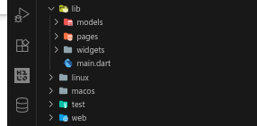

## Mendefinisikan Route

buat file `home_page.dart` dan `item_page.dart` dengan kode berikut

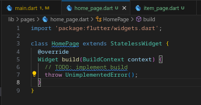

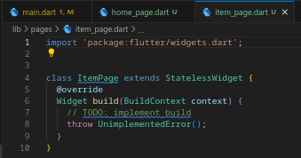

## Lengkapi Kode di main.dart

buat inisiasi route di main.dart seperti berikut

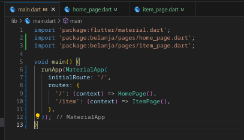

## Membuat data model

buat `item.dart` di folder models

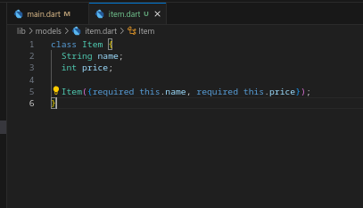

## Lengkapi kode di class HomePage

buat variabel items menggunakan objek `List<Item>` berisi list barang jualan

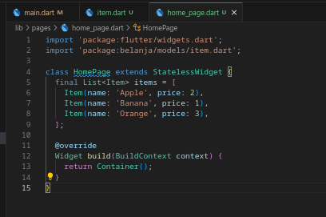

## Membuat ListView dan itemBuilder

kita disini membuat card masing-masing data itemnya

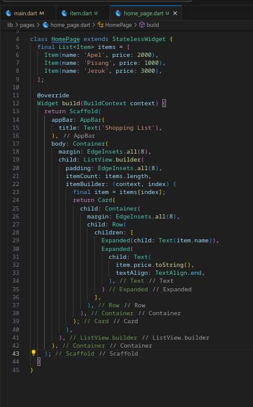

jadi hasilnya seperti berikut

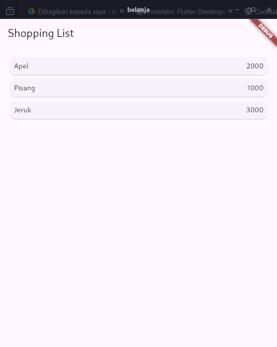

## Menambahkan aksi pada ListView

kita bisa masukan navigatornya disini

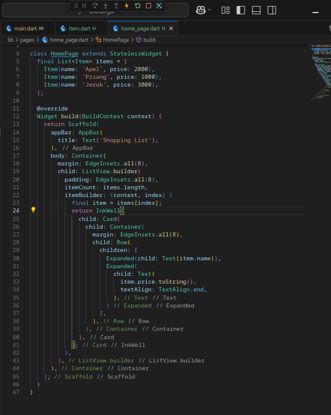

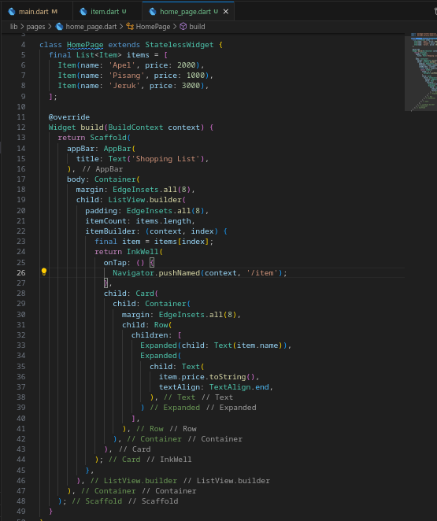

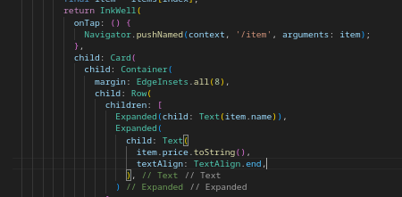

jadi jika di klik berhasil seperti berikut

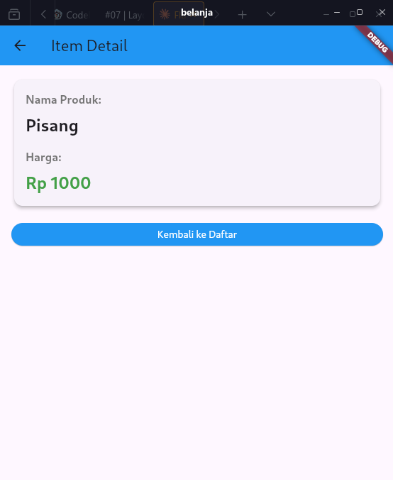

## praktikum percobaan

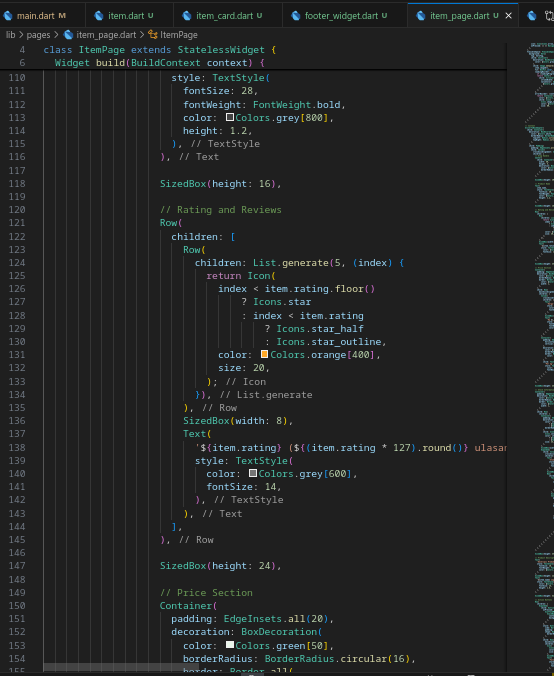

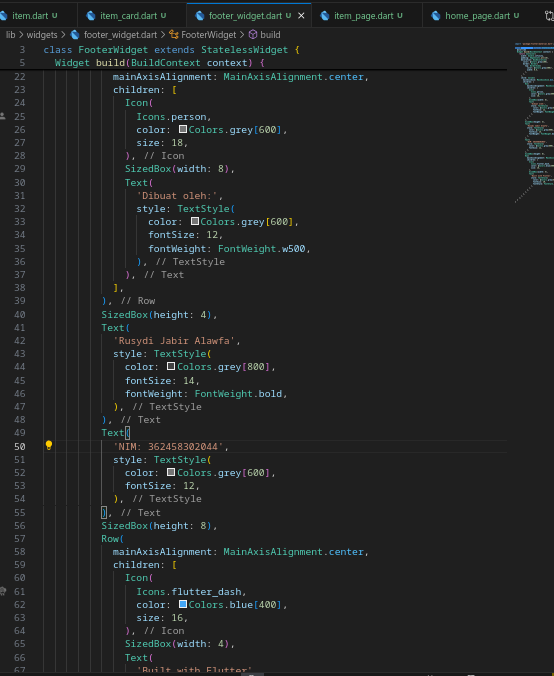

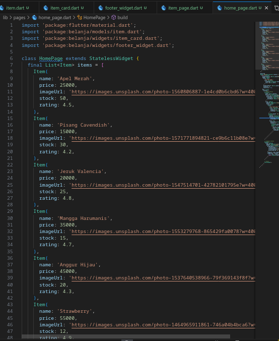

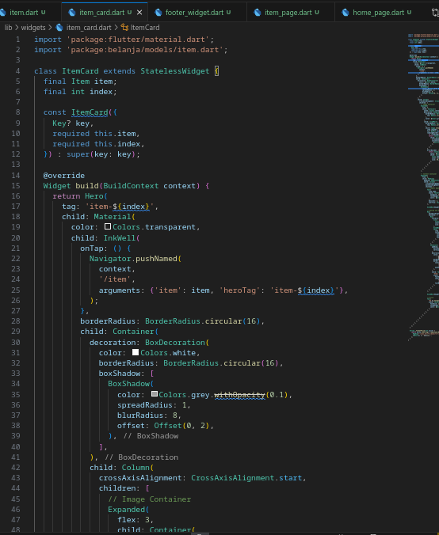

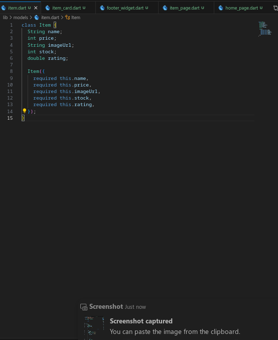

hasilnya menjadi seperti ini

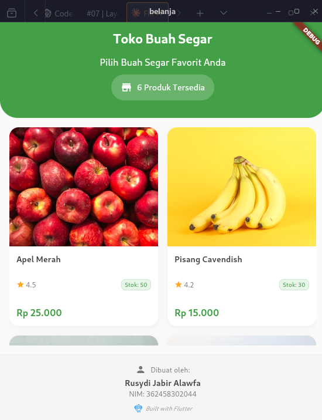

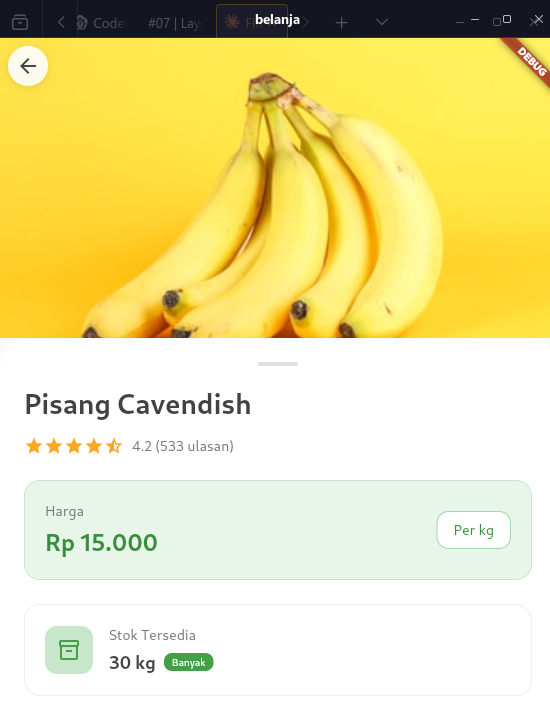